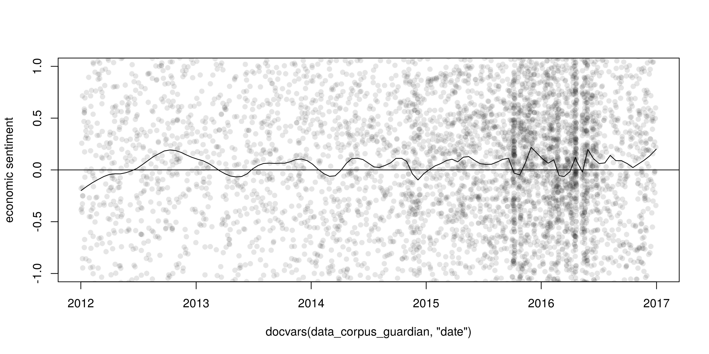
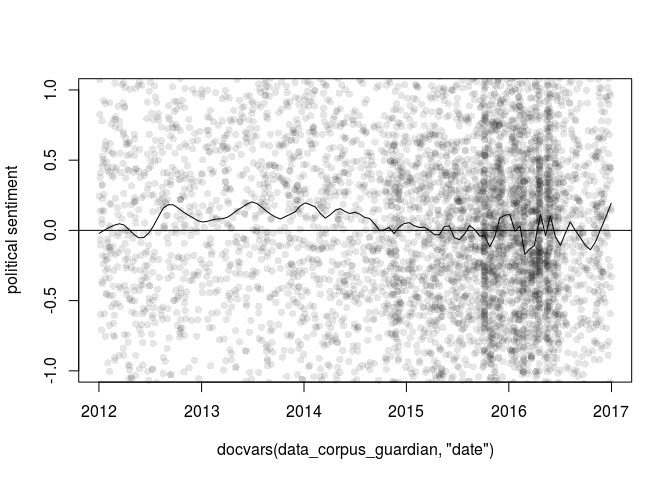
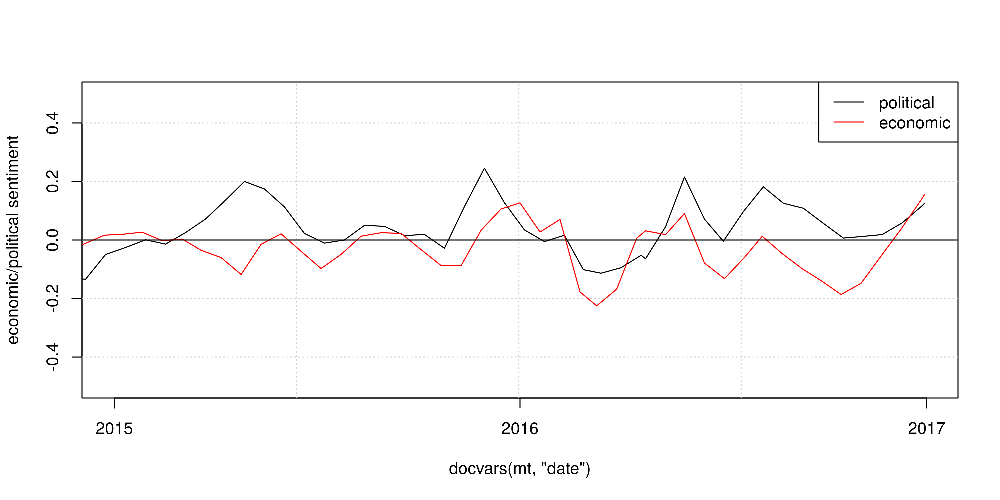

Latent Semantic Scaling
=======================

LSS is a highly efficient vector-space model for subject-specific sentiment analysis used by Kohei Watanabe in several published studies:

-   Kohei Watanabe, 2017. "[Measuring News Bias: Russia’s Official News Agency ITAR-TASS’s Coverage of the Ukraine Crisis](http://journals.sagepub.com/eprint/TBc9miIc89njZvY3gyAt/full)", *European Journal Communication*
-   Kohei Watanabe, 2017. "[The spread of the Kremlin’s narratives by a western news agency during the Ukraine crisis](http://www.tandfonline.com/eprint/h2IHsz2YKce6uJeeCmcd/full)", *Journal of International Communication*
-   Tomila Lankina and Kohei Watanabe. Forthcoming. ["Russian Spring’ or ‘Spring Betrayal’? The Media as a Mirror of Putin’s Evolving Strategy in Ukraine](http://www.tandfonline.com/eprint/tWik7KDfsZv8C2KeNkI5/full)", *Europe-Asia Studies*

How to install
--------------

``` r
devtools::install_github("koheiw/LSS")
```

How to use
----------

LSS is created to perform sentiment analysis of long texts, but training of its models should be done on smaller units, typically sentences. The [sample dataset](https://www.dropbox.com/s/555sr2ml6wc701p/guardian-sample.RData?dl=0) contains 6,000 Guardian news articles, but larger corpus should be used to [estimate parameters accurately](https://koheiw.net/?p=629).

### Fit a LSS model

``` r
require(quanteda)
require(LSS)
```

``` r
load('/home/kohei/Dropbox/Public/guardian-sample.RData')

corp_train <- corpus_reshape(data_corpus_guardian, 'sentences')
toks_train <- tokens(corp_train, remove_punct = TRUE)
mt_train <- dfm(toks_train, remove = stopwords())
mt_train <- dfm_remove(mt_train, c('*.uk', '*.com', '*.net', '*.it', '*@*'))
mt_train <- dfm_trim(mt_train, min_count = 10)

#' sentiment model on economy
eco <- char_keyness(toks_train, 'econom*')
lss_eco <- textmodel_lss(mt_train, seedwords('pos-neg'), pattern = eco)

head(lss_eco$beta) # most positive words
```

    ## opportunity    positive     success       force     reasons        bill 
    ##  0.04726892  0.04640303  0.04397306  0.04192484  0.04082709  0.03781205

``` r
tail(lss_eco$beta) # most negative words
```

    ##      caused        debt      blamed    negative        poor         bad 
    ## -0.05297691 -0.05692699 -0.05951016 -0.06556126 -0.06617859 -0.07506342

``` r
# sentiment model on politics
pol <- char_keyness(toks_train, 'politi*')
lss_pol <- textmodel_lss(mt_train, seedwords('pos-neg'), pattern = pol)

head(lss_pol$beta) # most positive words
```

    ##      views      faith    playing      force    reasons       bill 
    ## 0.04225050 0.04208257 0.04206229 0.04192484 0.04082709 0.03781205

``` r
tail(lss_pol$beta) # most negative words
```

    ##       power uncertainty     turmoil        lack     happens        talk 
    ## -0.04075780 -0.04218875 -0.04244589 -0.04791498 -0.04879530 -0.04967138

Predict sentiment of news
-------------------------

``` r
mt <- dfm(data_corpus_guardian)
```

### Economic sentiment

``` r
sent_eco <- scale(predict(lss_eco, newdata = mt))
plot(docvars(data_corpus_guardian, 'date'), sent_eco, pch = 16, col = rgb(0, 0, 0, 0.1),
     ylim = c(-1, 1), ylab = 'economic sentiment')
lines(lowess(docvars(data_corpus_guardian, 'date'), sent_eco, f = 0.05), col = 1)
abline(h = 0)
```



### Political sentiment

``` r
sent_pol <- scale(predict(lss_pol, newdata = mt))
plot(docvars(data_corpus_guardian, 'date'), sent_pol, pch = 16, col = rgb(0, 0, 0, 0.1),
      ylim = c(-1, 1), ylab = 'political sentiment')
lines(lowess(docvars(data_corpus_guardian, 'date'), sent_pol, f = 0.05), col = 1)
abline(h = 0)
```



### Comparison

The sentiment analysis models were trained on the same corpus with the same seed words, but they are sensitive to different subjects. We can see in the chart below that Guardian's framing of economy became positive in early 2015, while political sentiment were falling down gradually.

``` r
plot(docvars(data_corpus_guardian, 'date'), rep(0, ndoc(data_corpus_guardian)),  
     type = 'n', ylim = c(-0.5, 0.5), ylab = 'economic/political sentiment')
grid()
lines(lowess(docvars(data_corpus_guardian, 'date'), sent_pol, f = 0.1), col = 1)
lines(lowess(docvars(data_corpus_guardian, 'date'), sent_eco, f = 0.1), col = 2)
abline(h = 0)
legend('topright', lty = 1, col = 1:2, legend = c('political', 'economic'))
```


