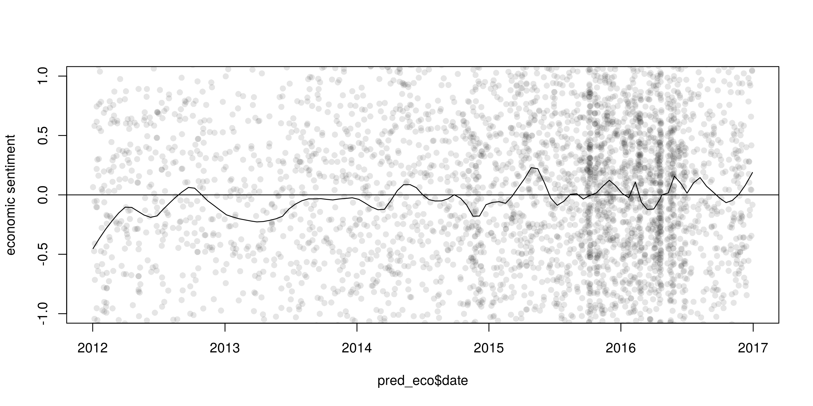
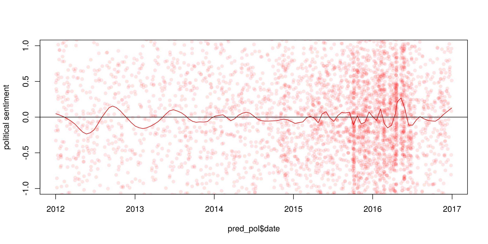
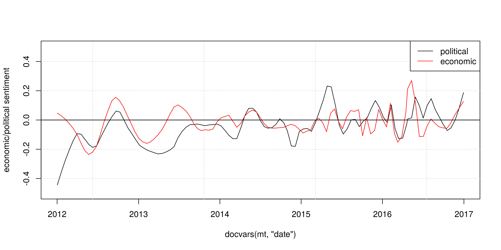

Latent Semantic Scaling
=======================

In machine learning, the cost for users to train a model and the control they have over its outputs usually correlate: supervised models are high in control but high in cost; unsupervised models are low in cost but low in control. However, social social scientists have to perform analysis based on existing theories and concepts with very limited computational, financial and human resources.

LSS is a semi-supervised document scaling model developed by Kohei Watanabe to perform large scale analysis of textual data by keeping the balance between the cost and control for [his PhD thesis](http://etheses.lse.ac.uk/3658/). Taking pre-defined *seed words* as weak supervision, it estimates word parameters in a latent semantic space.

This model has been used for large scale analysis of media content in recent research projects:

-   Kohei Watanabe, 2017. "[Measuring News Bias: Russia’s Official News Agency ITAR-TASS’s Coverage of the Ukraine Crisis](http://journals.sagepub.com/eprint/TBc9miIc89njZvY3gyAt/full)", *European Journal Communication*
-   Kohei Watanabe, 2017. "[The spread of the Kremlin’s narratives by a western news agency during the Ukraine crisis](http://www.tandfonline.com/eprint/h2IHsz2YKce6uJeeCmcd/full)", *Journal of International Communication*
-   Tomila Lankina and Kohei Watanabe. 2017. ["Russian Spring’ or ‘Spring Betrayal’? The Media as a Mirror of Putin’s Evolving Strategy in Ukraine](http://www.tandfonline.com/eprint/tWik7KDfsZv8C2KeNkI5/full)", *Europe-Asia Studies*

How to install
--------------

``` r
devtools::install_github("koheiw/LSS")
```

How to use
----------

LSS estimates semantic similarity of words based on their surrounding contexts, so a LSS model should be trained on data where the text unit is sentence. It is also affected by noises in data such as function words and punctuation marks, so they should also be removed. It requires larger corpus of texts (5000 or more documents) to accurately estimate semantic proximity. The [sample corpus](https://www.dropbox.com/s/kfhdoifes7z7t6j/data_corpus_guardian2016-10k.RDS?dl=1) contains 10,000 Guardian news articles from 2016.

### Fit a LSS model

``` r
require(quanteda)
require(LSS)
```

``` r
corp <- readRDS('/home/kohei/Dropbox/Public/data_corpus_guardian2016-10k.rds')

toks_sent <- corp %>% 
    corpus_reshape('sentences') %>% 
    tokens(remove_punct = TRUE)
mt_sent <- toks_sent %>% 
    dfm(remove = stopwords()) %>% 
    dfm_select('^[0-9a-zA-Z]+$', valuetype = 'regex') %>% 
    dfm_trim(min_termfreq = 5)

#' sentiment model on economy
eco <- head(char_keyness(toks_sent, 'econom*'), 500)
lss_eco <- textmodel_lss(mt_sent, seedwords('pos-neg'), features = eco)

# sentiment model on politics
pol <- head(char_keyness(toks_sent, 'politi*'), 500)
lss_pol <- textmodel_lss(mt_sent, seedwords('pos-neg'), features = pol)
```

### Sentiment seed words

Seed words are 14 generic sentiment words.

``` r
seedwords('pos-neg')
```

    ##        good        nice   excellent    positive   fortunate     correct 
    ##           1           1           1           1           1           1 
    ##    superior         bad       nasty        poor    negative unfortunate 
    ##           1          -1          -1          -1          -1          -1 
    ##       wrong    inferior 
    ##          -1          -1

### Sentiment words

LSS identifies domain specific words and weight them by sentiment.

#### Economic words

``` r
head(coef(lss_eco), 20) # most positive words
```

    ##    positive    emerging       china   expecting cooperation        drag 
    ##  0.03941849  0.03906230  0.03249657  0.03172653  0.03014628  0.02910002 
    ##        asia        prof sustainable    academic challenging     markets 
    ##  0.02873776  0.02849241  0.02765765  0.02732935  0.02682587  0.02644153 
    ##   investors     beijing   prospects       stock   uncertain   strategic 
    ##  0.02637175  0.02572956  0.02570061  0.02538831  0.02358457  0.02346433 
    ##         hit     chinese 
    ##  0.02302436  0.02291012

``` r
tail(coef(lss_eco), 20) # most negative words
```

    ##       macron     suggests     downbeat         debt         data 
    ##  -0.03258820  -0.03277442  -0.03309793  -0.03386571  -0.03524238 
    ## implications policymakers   unbalanced       shrink unemployment 
    ##  -0.03692698  -0.03745570  -0.03934074  -0.03944345  -0.03987688 
    ##    suggested          bad     pantheon      cutting       shocks 
    ##  -0.04036920  -0.04047418  -0.04054125  -0.04082423  -0.04267978 
    ##         hike        rates          rba         rate     negative 
    ##  -0.04370420  -0.04405703  -0.04789902  -0.05417844  -0.05697134

#### Political words

``` r
head(coef(lss_pol), 20) # most positive words
```

    ##           court            hong  constitutional            near 
    ##      0.04106994      0.03633278      0.03548125      0.02894814 
    ##          robert         elected          career               f 
    ##      0.02879851      0.02865901      0.02862221      0.02735207 
    ##      activities    interference representatives              10 
    ##      0.02611407      0.02610918      0.02522913      0.02498850 
    ##       companies          killed           links         attempt 
    ##      0.02406716      0.02338786      0.02309744      0.02290495 
    ##         correct        lecturer          action       activists 
    ##      0.02283412      0.02246062      0.02243432      0.02175429

``` r
tail(coef(lss_pol), 20) # most negative words
```

    ##    departure       debate  calculation  uncertainty        union 
    ##  -0.02360299  -0.02469601  -0.02591610  -0.02624996  -0.02637228 
    ##    prisoners          men       brexit     american     averages 
    ##  -0.02651267  -0.02676563  -0.02704382  -0.02865085  -0.02874191 
    ##      divided    landscape        often consequences        dirty 
    ##  -0.02876009  -0.02886668  -0.02944733  -0.03048922  -0.03102530 
    ##    countries    dominated  complicated         data          cut 
    ##  -0.03194409  -0.03228346  -0.03351240  -0.03524238  -0.05498620

Predict sentiment of news
-------------------------

In the plots, circles indicate estimated sentiment of news articles. After the UK's referendum on EU membership on 23 June, we can see sharp drop in both economic and political sentiment in the newspaper articles. Economic sentiment recovered within a month, but negative political sentiment sustained.

``` r
mt <- dfm(corp)
```

### Economic sentiment

``` r
pred_eco <- as.data.frame(predict(lss_eco, newdata = mt, density = TRUE))
pred_eco$date <- docvars(mt, 'date')

plot(pred_eco$date, pred_eco$fit, pch = 16, col = rgb(0, 0, 0, 0.1),
     ylim = c(-1, 1), ylab = 'economic sentiment')
lines(lowess(pred_eco$date, pred_eco$fit, f = 0.05), col = 1)
abline(h = 0, v = as.Date("2016-06-23"), lty = c(1, 3))
```



### Political sentiment

``` r
pred_pol <- as.data.frame(predict(lss_pol, newdata = mt, density = TRUE))
pred_pol$date <- docvars(mt, 'date')

plot(pred_pol$date, pred_pol$fit, pch = 16, col = rgb(1, 0, 0, 0.1),
     ylim = c(-1, 1), ylab = 'political sentiment')
lines(lowess(pred_pol$date, pred_pol$fit, f = 0.05), col = 2)
abline(h = 0, v = as.Date("2016-06-23"), lty = c(1, 3))
```



### Comparison

``` r
plot(docvars(mt, 'date'), rep(0, ndoc(mt)), type = 'n',
     ylim = c(-0.5, 0.5), ylab = 'economic/political sentiment')
grid()
lines(lowess(pred_eco$date, pred_eco$fit, f = 0.05), col = 1)
lines(lowess(pred_pol$date, pred_pol$fit, f = 0.05), col = 2)
abline(h = 0)
legend('topright', lty = 1, col = 1:2, legend = c('political', 'economic'))
abline(h = 0, v = as.Date("2016-06-23"), lty = c(1, 3))
```


