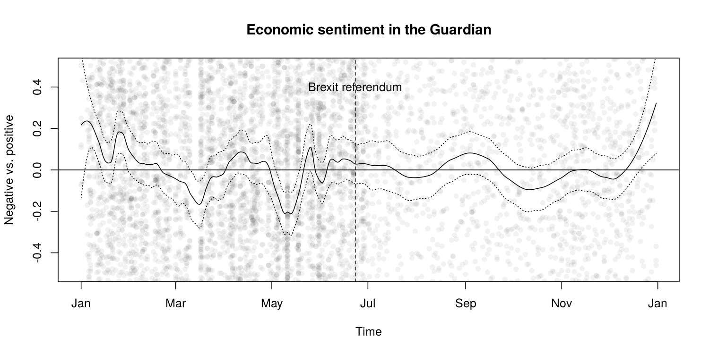

# Latent Semantic Scaling

**NOTICE:** This R package is renamed from **LSS** to **LSX** for CRAN
submission.

In quantitative text analysis, the cost to train supervised machine
learning models tend to be very high when the corpus is large. LSS is a
semisupervised document scaling method that I developed to perform large
scale analysis at low cost. Taking user-provided *seed words* as weak
supervision, it estimates polarity of words in the corpus by latent
semantic analysis and locates documents on a unidimensional scale
(e.g. sentiment).

I used LSS for large scale analysis of media content in several research
projects:

  - Kohei Watanabe, 2017. “[Measuring News Bias: Russia’s Official News
    Agency ITAR-TASS’s Coverage of the Ukraine
    Crisis](https://journals.sagepub.com/eprint/TBc9miIc89njZvY3gyAt/full)”,
    *European Journal Communication*
  - Kohei Watanabe, 2017. “[The spread of the Kremlin’s narratives by a
    western news agency during the Ukraine
    crisis](https://www.tandfonline.com/eprint/h2IHsz2YKce6uJeeCmcd/full)”,
    *Journal of International Communication*
  - Tomila Lankina and Kohei Watanabe. 2017. ["Russian Spring’ or
    ‘Spring Betrayal’? The Media as a Mirror of Putin’s Evolving
    Strategy in
    Ukraine](https://www.tandfonline.com/eprint/tWik7KDfsZv8C2KeNkI5/full)",
    *Europe-Asia Studies*

Please read [my working
paper](https://blog.koheiw.net/wp-content/uploads/2020/04/LSS-06.pdf)
for the algorithm and methodology.

## How to install

``` r
devtools::install_github("koheiw/LSX")
```

## How to use

LSS estimates semantic similarity of words based on their surrounding
contexts, so a LSS model should be trained on data where the text unit
is sentence. It is also affected by noises in data such as function
words and punctuation marks, so they should also be removed. It requires
larger corpus of texts (5000 or more documents) to accurately estimate
semantic proximity. The [sample corpus](https://bit.ly/2GZwLcN) contains
10,000 Guardian news articles from 2016.

### Fit a LSS model

``` r
require(quanteda)
require(LSX) # changed from LSS to LSX
```

``` r
corp <- readRDS("/home/kohei/Dropbox/Public/data_corpus_guardian2016-10k.rds")

toks_sent <- corp %>% 
    corpus_reshape("sentences") %>% 
    tokens(remove_punct = TRUE) %>% 
    tokens_remove(stopwords("en"), padding = TRUE)
dfmt_sent <- toks_sent %>% 
    dfm(remove = "") %>% 
    dfm_select("^\\p{L}+$", valuetype = "regex", min_nchar = 2) %>% 
    dfm_trim(min_termfreq = 5)

eco <- char_keyness(toks_sent, "econom*", p = 0.05)
lss <- textmodel_lss(dfmt_sent, as.seedwords(data_dictionary_sentiment),
                     terms = eco, k = 300, cache = TRUE)
```

    ## Writing cache file: lss_cache/svds_365ae974a33cb811.RDS

### Sentiment seed words

Seed words are 14 generic sentiment words.

``` r
data_dictionary_sentiment
```

    ## Dictionary object with 2 key entries.
    ## - [positive]:
    ##   - good, nice, excellent, positive, fortunate, correct, superior
    ## - [negative]:
    ##   - bad, nasty, poor, negative, unfortunate, wrong, inferior

### Economic sentiment words

Economic words are weighted in terms of sentiment based on the proximity
to seed words.

``` r
head(coef(lss), 20) # most positive words
```

    ##       shape      either    positive      monday   expecting sustainable 
    ##  0.04020799  0.03744890  0.03601425  0.03336808  0.03307447  0.03276316 
    ##      decent     several    emerging        york   candidate challenging 
    ##  0.03084397  0.03076411  0.03047059  0.02929349  0.02883675  0.02800941 
    ##      argued        able  powerhouse        asia       thing        drag 
    ##  0.02774260  0.02751587  0.02719956  0.02716442  0.02661455  0.02635362 
    ##         aid       stock 
    ##  0.02610316  0.02607838

``` r
tail(coef(lss), 20) # most negative words
```

    ##     actually        allow      nothing      cutting       shrink        grows 
    ##  -0.03531395  -0.03665382  -0.03701008  -0.03737425  -0.03813055  -0.03854666 
    ##         debt implications policymakers    suggested     interest    something 
    ##  -0.03872572  -0.03944662  -0.04014394  -0.04113985  -0.04290556  -0.04311326 
    ##    borrowing unemployment         hike        rates         rate          rba 
    ##  -0.04490317  -0.04505639  -0.04570329  -0.04859105  -0.04875628  -0.05079627 
    ##          cut     negative 
    ##  -0.05596225  -0.06174176

This plot shows that frequent words (“said”, “people”, “also”) are
neutral while less frequent words such as “borrowing”, “unemployment”,
“emerging” and “efficient” are either negative or positive.

``` r
textplot_terms(lss, 
               highlighted = c("said", "people", "also",
                               "borrowing", "unemployment",
                               "emerging", "efficient"))
```

<!-- -->

## Result of analysis

In the plots, circles indicate sentiment of individual news articles and
lines are their local average (solid line) with a confidence band
(dotted lines). According to the plot, economic sentiment in the
Guardian news stories became negative from February to April, but it
become more positive in April. As the referendum approaches, the
newspaper’s sentiment became less stable, although it became close to
neutral (overall mean) on the day of voting (broken line).

``` r
dfmt <- dfm(corp)

# predict sentiment scores
pred <- as.data.frame(predict(lss, se.fit = TRUE, newdata = dfmt))
pred$date <- docvars(dfmt, "date")
pred <- na.omit(pred)

# smooth LSS scores
pred_sm <- smooth_lss(pred, from = as.Date("2016-01-01"), to = as.Date("2016-12-31"))

# plot trend
plot(pred$date, pred$fit, col = rgb(0, 0, 0, 0.05), pch = 16, ylim = c(-0.5, 0.5),
     xlab = "Time", ylab = "Negative vs. positive", main = "Economic sentiment in the Guardian")
lines(pred_sm$date, pred_sm$fit, type = "l")
lines(pred_sm$date, pred_sm$fit + pred_sm$se.fit * 2, type = "l", lty = 3)
lines(pred_sm$date, pred_sm$fit - pred_sm$se.fit * 2, type = "l", lty = 3)
abline(h = 0, v = as.Date("2016-06-23"), lty = c(1, 2))
text(as.Date("2016-06-23"), 0.4, "Brexit referendum")
```

<!-- -->
