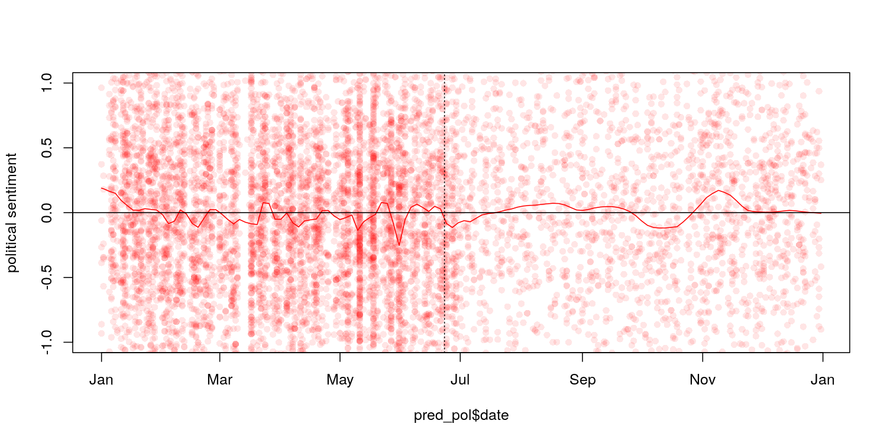
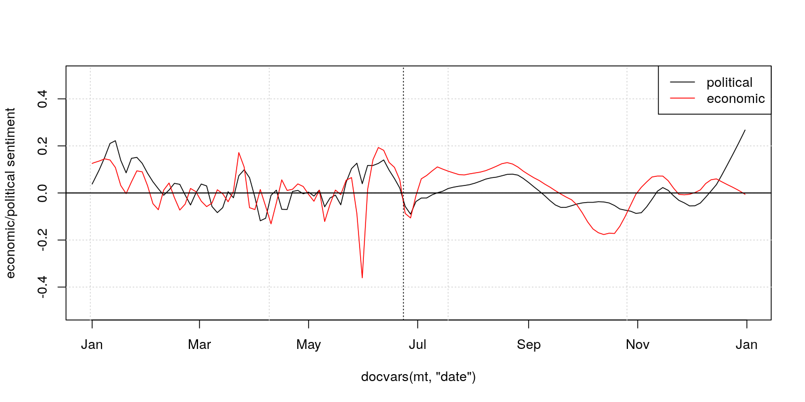

# Latent Semantic Scaling

In machine learning, the cost for users to train a model and the control
they have over its outputs usually correlate: supervised models are high
in control but high in cost; unsupervised models are low in cost but low
in control. However, social social scientists have to perform analysis
based on existing theories and concepts with very limited computational,
financial and human resources.

LSS is a semi-supervised document scaling model developed by Kohei
Watanabe to perform large scale analysis of textual data by keeping the
balance between the cost and control for [his PhD
thesis](http://etheses.lse.ac.uk/3658/). Taking pre-defined *seed words*
as weak supervision, it estimates word parameters in a latent semantic
space.

This model has been used for large scale analysis of media content in
recent research projects:

  - Kohei Watanabe, 2017. “[Measuring News Bias: Russia’s Official News
    Agency ITAR-TASS’s Coverage of the Ukraine
    Crisis](http://journals.sagepub.com/eprint/TBc9miIc89njZvY3gyAt/full)”,
    *European Journal Communication*
  - Kohei Watanabe, 2017. “[The spread of the Kremlin’s narratives by a
    western news agency during the Ukraine
    crisis](http://www.tandfonline.com/eprint/h2IHsz2YKce6uJeeCmcd/full)”,
    *Journal of International Communication*
  - Tomila Lankina and Kohei Watanabe. 2017. ["Russian Spring’ or
    ‘Spring Betrayal’? The Media as a Mirror of Putin’s Evolving
    Strategy in
    Ukraine](http://www.tandfonline.com/eprint/tWik7KDfsZv8C2KeNkI5/full)",
    *Europe-Asia Studies*

## How to install

``` r
devtools::install_github("koheiw/LSS")
```

## How to use

LSS estimates semantic similarity of words based on their surrounding
contexts, so a LSS model should be trained on data where the text unit
is sentence. It is also affected by noises in data such as function
words and punctuation marks, so they should also be removed. It requires
larger corpus of texts (5000 or more documents) to accurately estimate
semantic proximity. The [sample
corpus](https://www.dropbox.com/s/kfhdoifes7z7t6j/data_corpus_guardian2016-10k.RDS?dl=1)
contains 10,000 Guardian news articles from 2016.

### Fit a LSS model

``` r
require(quanteda)
require(LSS)
```

``` r
corp <- readRDS('/home/kohei/Dropbox/Public/data_corpus_guardian2016-10k.rds')

toks_sent <- corp %>% 
    corpus_reshape('sentences') %>% 
    tokens(remove_punct = TRUE)
mt_sent <- toks_sent %>% 
    dfm(remove = stopwords()) %>% 
    dfm_select('^[a-zA-Z]+$', valuetype = 'regex', min_nchar = 2) %>% 
    dfm_trim(min_termfreq = 5)

#' sentiment model on economy
eco <- head(char_keyness(toks_sent, 'econom*'), 500)
lss_eco <- textmodel_lss(mt_sent, seedwords('pos-neg'), features = eco)

# sentiment model on politics
pol <- head(char_keyness(toks_sent, 'politi*'), 500)
lss_pol <- textmodel_lss(mt_sent, seedwords('pos-neg'), features = pol)
```

### Sentiment seed words

Seed words are 14 generic sentiment
    words.

``` r
seedwords('pos-neg')
```

    ##        good        nice   excellent    positive   fortunate     correct 
    ##           1           1           1           1           1           1 
    ##    superior         bad       nasty        poor    negative unfortunate 
    ##           1          -1          -1          -1          -1          -1 
    ##       wrong    inferior 
    ##          -1          -1

### Sentiment words

LSS identifies domain specific words and weight them by
    sentiment.

#### Economic words

``` r
head(coef(lss_eco), 20) # most positive words
```

    ##    positive   expecting    emerging   professor sustainable      decent 
    ##  0.04198759  0.04041890  0.03913838  0.03453550  0.03438302  0.03208933 
    ##      oxford       stock        prof    academic     markets   efficient 
    ##  0.03161188  0.03147390  0.03014006  0.02986570  0.02947902  0.02903777 
    ##      failed        asia  management         hit consultancy       slide 
    ##  0.02804538  0.02780202  0.02704815  0.02670997  0.02659349  0.02640886 
    ##     impacts       china 
    ##  0.02586232  0.02559905

``` r
tail(coef(lss_eco), 20) # most negative words
```

    ##       brexit        pound    situation         data         rise 
    ##  -0.03378953  -0.03410171  -0.03439309  -0.03457411  -0.03495389 
    ##       impact     pantheon implications      cutting     downbeat 
    ##  -0.03535304  -0.03546813  -0.03565484  -0.03590826  -0.03597810 
    ##         debt     interest    suggested     suggests         hike 
    ##  -0.03636211  -0.03762701  -0.03864661  -0.03928283  -0.04396055 
    ##        rates         rate unemployment          rba     negative 
    ##  -0.04638569  -0.04689606  -0.04810378  -0.05048054  -0.06004318

#### Political words

``` r
head(coef(lss_pol), 20) # most positive words
```

    ##         correct  constitutional     commentator          battle 
    ##      0.04617497      0.03838595      0.03682553      0.03494310 
    ##       professor           court      university          killed 
    ##      0.03453550      0.03383873      0.02973055      0.02935159 
    ##            near         process        lecturer representatives 
    ##      0.02786398      0.02731266      0.02720056      0.02698998 
    ##           laura         elected       relatives          robert 
    ##      0.02482720      0.02462219      0.02432675      0.02395674 
    ##          career            hong         reasons        involved 
    ##      0.02390902      0.02288129      0.02280180      0.02272463

``` r
tail(coef(lss_pol), 20) # most negative words
```

    ##     increase     purposes         talk    motivated       showed 
    ##  -0.02656812  -0.02661012  -0.02661925  -0.02663048  -0.02764339 
    ##     promises  calculation consequences          row        often 
    ##  -0.02847466  -0.02879053  -0.02903463  -0.02939308  -0.03084510 
    ##  complicated        dirty    movements       debate   discussion 
    ##  -0.03151053  -0.03228046  -0.03235362  -0.03269543  -0.03360233 
    ##       brexit         data    departure    dominated          cut 
    ##  -0.03378953  -0.03457411  -0.03629428  -0.03700214  -0.05993724

## Predict sentiment of news

In the plots, circles indicate estimated sentiment of news articles.
After the UK’s referendum on EU membership on 23 June, we can see sharp
drop in both economic and political sentiment in the newspaper articles.
Economic sentiment recovered within a month, but negative political
sentiment
sustained.

``` r
mt <- dfm(corp)
```

### Economic sentiment

``` r
pred_eco <- as.data.frame(predict(lss_eco, newdata = mt, density = TRUE))
pred_eco$date <- docvars(mt, 'date')
pred_eco <- na.omit(pred_eco)

plot(pred_eco$date, pred_eco$fit, pch = 16, col = rgb(0, 0, 0, 0.1),
     ylim = c(-1, 1), ylab = 'economic sentiment')
lines(lowess(pred_eco$date, pred_eco$fit, f = 0.05), col = 1)
abline(h = 0, v = as.Date("2016-06-23"), lty = c(1, 3))
```

<!-- -->

### Political sentiment

``` r
pred_pol <- as.data.frame(predict(lss_pol, newdata = mt, density = TRUE))
pred_pol$date <- docvars(mt, 'date')
pred_pol <- na.omit(pred_pol)

plot(pred_pol$date, pred_pol$fit, pch = 16, col = rgb(1, 0, 0, 0.1),
     ylim = c(-1, 1), ylab = 'political sentiment')
lines(lowess(pred_pol$date, pred_pol$fit, f = 0.05), col = 2)
abline(h = 0, v = as.Date("2016-06-23"), lty = c(1, 3))
```

<!-- -->

### Comparison

``` r
plot(docvars(mt, 'date'), rep(0, ndoc(mt)), type = 'n',
     ylim = c(-0.5, 0.5), ylab = 'economic/political sentiment')
grid()
lines(lowess(pred_eco$date, pred_eco$fit, f = 0.05), col = 1)
lines(lowess(pred_pol$date, pred_pol$fit, f = 0.05), col = 2)
abline(h = 0)
legend('topright', lty = 1, col = 1:2, legend = c('political', 'economic'))
abline(h = 0, v = as.Date("2016-06-23"), lty = c(1, 3))
```

<!-- -->
